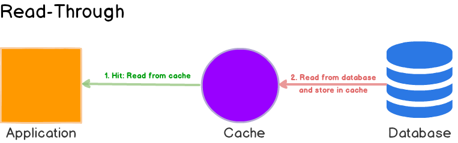

# System design

Keep it simple. Creating distributed systems is expensive both money wise and maintenance/resource wise. If something can be made in a single system, then it's better approach initially.

**With distributed cache or anything distributed you always want to have passive replica of your entity. This is needed in case your master entity goes down, you want to quicky recover from that**

# Distributed System Characteristics

  - **No shared clock:** Difference in time (clock drift), issue with ordering of events and communication between nodes
  - **No shared memory:** Request for additional memory
  - **Shared resources:** Data between nodes should be shared
  - **Concurrency and consistency**

## Issues
  - Clients can't find server
  - Server crashes mid request
  - Server response is lost
  - Client crashes

## Benefits

  - More reliable, fault tolerant (replicas)
  - Scalability (horizontal - add more machines)
  - Lower latency, increase performance (processes distributed across multiple machines)
  - Cost effective

## Scalability

  - Achieve growth without loss of performance
  - Increased volume of data or requests

## Reliability

  - Probability a system will fail during a period of time
    - **MTBF:** Mean Time Before Failure **(prediction of when system will fail)** = (Total Elapsed Time - total downtime) / number of failures
  - Harder to define than hardware reliability, since hardware failure is more apparent

## Availability

  - Amount of time system is operational during period of time
  - Minimal downtime for maintenance

## Latency

  - Avoid network calls whenever possible
  - Replicate data across data centers for recovery and performance
  - Keep frequently accessed data in memory rather than in cache ro disk

## Scaling

  - **Vertical:** Upgrading hardware of your machine to increase performance (single point of failure, but relatively simple)
  - **Horizontal:** Add additional machines to increase performance (more robust, but complex)

# System Design Components

## Load Balancers
  - Balance incoming traffic from multiple servers
  - Used to improve reliability and scalability of applications
  - Examples
    - Software based (portable, can switch to others easiliy)
      - Nginx
      - HAProxy
    - Hardware based (vendor locking, hard to switch)
      - F5
      - Citrix
  - Routing Methods
    - **Round Robin** Most simple, cycles throw each server sequentially. Uneven traffic
    - **Least Connections** Routes based on number of client connections to server (chat server)
    - **Least Response Time** Routes based on how quickly servers respond
    - **IP Hash** Routes clients to server based on client's IP address
  - Load Balancer types
    
    A lot of designs first route requests through L4 and then L7
    
    - **Layer 4** 
      - Only has access to TCP data 
      - Faster
      - Lack of information can lead to even traffic
      - Usefuly to act upon requests early, such as based on IP address
    - **Layer 7**
      - Full access to HTP protocol and data
      - Check for authentication
      - Smarter routing options since we know what request is
      - More CPU intesive, slower than L4

When you have single load balancer, you have the same issue as not having a LB since it can also fail. That's why having multiple LB's can lessen the possibility of one LB going down, because they communicate with each other to spread the requests.

# Caching

Taking data that would normally be stored on hard drive and store it in memory.

## Advantages
  
  - Improves application performance
  - Saves money on bandwidth
  - Speed and performance 

Client <--> App Server <--> Cache <-- If data not in cache, query database --> Database

**Example** 

We have application where people buy widgets. App stores data about widget prices that don't change a lot. Instead of going to database every time widget price is needed, we can setup a cache where these prices will be stored so that we don't have to go to datbase each time.

#### Caching Layers

  - DNS
  - CDN
  - Application
  - Database

#### Distributed Cache

  - Works as traditional cache
  - Has built-in functionality to replicate data, shard data across servers, and locate proper server for each key

#### Cache eviction

When cached data is updated in the database, you want to remove it from cache after database update so that cache can be filled up with most recent data

  - Preventing stale data
  - Caching only most valuable data to save resources

  - TTL (Time To Live)
    - Set time period before cache entry is deleted
    - Used to prevent stale data

  - LRU (Least Recently Used)
    -  Once cache is full, remove last accessed key and add new key

  - LFU (Least Recently Used)
    -  Track number of times key is accessed
    -  Drop least used when cache is full

# Caching Strategies

**Best for read-heavy workloads (Memcached and Redis)**

   - Application first checks cache
   - If data is found in cache, the data is returned to client
   - if data is not found, data is read from the database, added to cache and returned to client
   - Resilient to cache failure
   - Data can become inconsistent
    

**Best for read-heavy**

   - Read-through cache sits in-line with the database. When there is a cache miss, it loads missing data from database, populates the cache and returns it to the application
   - Logic is usually supported by the library or stand-alone cache provider Unlike cache-aside, the data model in read-through cache cannot be different than that of the database
   - Disadvantage is that when the data is requested the first time, it always results in cache miss and incurs the extra penalty of loading data to the cache. To deal with this, cache is warmed up with manually populating cache

Data is first written to cache and the to data store.

# Write-Around

Data is written only to the backing store without writing to the cache. So, I/O completion is confirmed as soon as the data is written to the backing store.

**Good for write-heavy**

  - Writes to cache and then flushes to database after some interva;
  - Resilient to database failures

# Database scaling

  - **Verical scaling** Move to bigger database
  - **Indexing**
  - **Denormalization**
  - **Connection Pool**
  - **Caching**
  - **Replication and Partitioning**
